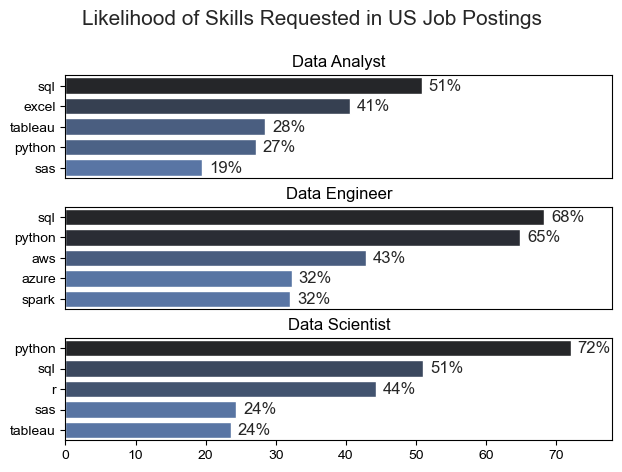

# The Analysis

## 1. What are the most demanded skills for the top 3 most popular data roles?

To find the most demanded skills for the top 3 most popular data roles. I filtered out those positions by which ones were the most popular, and got the top 5 skills for these top 3 roles. This query higlights the most popular job titles and their top skills, showing which skills I should pay attention to depending on the role I'm targeting.

view my notebook with detailed steps here: [2_skills_count.py](1_Project/2_skills_count.py)

### Visualize Data

```python
fig, ax = plt.subplots(len(job_titles),1)

for i, job_title in enumerate(job_titles):
    df_plot = df_skills_perc[df_skills_perc['job_title_short'] == job_title].head(5)[::-1]
    sns.barplot(data=df_plot, x='skill_percent', y='job_skills', ax=ax[i], hue='skill_count', palette='dark:b_r')

plt.show()
```

### Results



## Insights from "Likelihood of Skills Requested in US Job Postings" Chart

The chart presents an overview of the most requested skills in US job postings for three key data-related roles: Data Analyst, Data Engineer, and Data Scientist. The insights below summarize the key findings:

### Data Analyst

- **SQL** is the most in-demand skill for Data Analysts, appearing in 51% of job postings. This underscores the critical importance of SQL for data querying and manipulation in this role.
- **Excel** follows with a 41% demand, highlighting its continued relevance for data analysis, reporting, and visualization tasks.
- **Tableau** and **Python** are also significant, being requested in 28% and 27% of postings, respectively. This indicates the need for proficiency in both data visualization and programming/scripting.
- **SAS** is less in demand, with 19% of job postings requiring it, which might suggest a trend towards open-source tools over traditional proprietary software.

### Data Engineer

- **SQL** and **Python** dominate the skill set for Data Engineers, with 68% and 65% of job postings respectively. This reflects the necessity of these skills for managing and transforming large datasets.
- **AWS** is also highly sought after, appearing in 43% of postings, highlighting the growing importance of cloud infrastructure and services in data engineering.
- **Azure** and **Spark** are equally demanded, with each appearing in 32% of postings. This indicates the need for proficiency in various cloud platforms and big data processing frameworks.

### Data Scientist

- **Python** is the most critical skill for Data Scientists, required in 72% of job postings, emphasizing its essential role in data analysis, machine learning, and statistical modeling.
- **SQL** follows at 51%, showing its continued importance for database management and data extraction tasks in this role.
- **R** is requested in 44% of job postings, indicating its significance in statistical computing and graphics.
- **SAS** and **Tableau** are each demanded in 24% of postings, pointing to a need for both statistical software and data visualization skills, albeit to a lesser extent compared to Python and SQL.

### General Trends

- **SQL** is consistently in high demand across all three roles, confirming its status as a fundamental skill in the data industry.
- **Python** is increasingly important, particularly for Data Scientists and Data Engineers, reflecting the language's versatility and dominance in data-related tasks.
- **Cloud platforms (AWS and Azure)** and **big data frameworks (Spark)** are crucial for Data Engineers, showing the industry's shift towards scalable and distributed data processing.
- **R** and **SAS** remain relevant but are less dominant compared to open-source alternatives like Python.

These insights can guide individuals seeking to enter or advance in these data-related roles, highlighting the most valuable skills to develop based on current job market demands.

## 2. How are in demand skills trending for Data Analyst?

### Visualize Data

```python
from matplotlib.ticker import PercentFormatter

df_plot = df_DA_US_percent.iloc[:, :5]
sns.lineplot(data=df_plot,dashes=False,legend='full', palette='tab10')

plt.gca().yaxis.set_major_formatter(PercentFormatter(decimals=0))

plt.show()

```

### Results

[Trending Top Skills for Data Analyst in the US](1_Project/Images/skills_trend_DA.png)_Bar graph visualizing the trending top skills for data analysts in the US 2023._

### Key Insights:

SQL: Consistently the most requested skill, though it saw a slight decline from 60% to around 50% by year-end.
Excel: Stable demand early in the year (~45%) with a dip mid-year, but recovering to 40% in December.
Python: Steady growth, rising from ~30% in mid-year to 35% by December, reflecting its increasing importance.
Tableau: Consistent demand (~30%), highlighting its ongoing relevance in data visualization.
Power BI: Less demanded (~20%), but its consistent presence suggests growing importance, especially in Microsoft ecosystems.
Trends:
Mid-Year Dip: General decline in skill demand from June to September, with SQL and Excel particularly affected.
Year-End Recovery: Excel and Python saw increased demand towards the end of the year, indicating seasonal or renewed interest.
